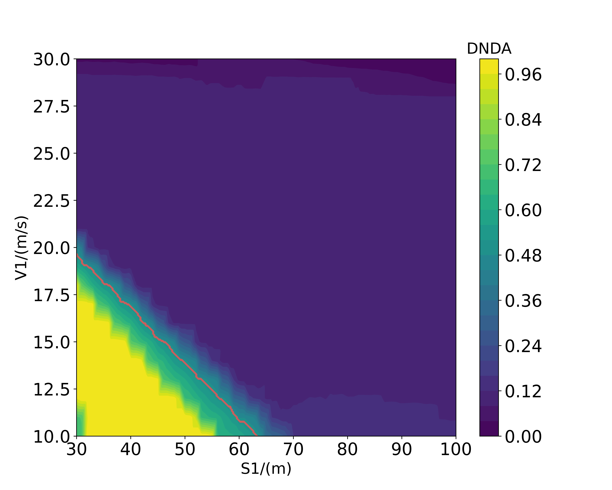

### IV2023-papaer-'Accelerated Testing of Autonomous Vehicles Based on Dual Surrogates'

## experiment in Cut in scenario
The scenario configuration is shown as below.

A fine-grained grid (100×100) search is performed to get the ground truth of the objective function in the parameter space for benchmarking. As shown below, the critical subspaces are identified with red outlines.

## A.Validation of the Accelerated Testing Method

## B.Validation of the Behavior Surrogate

The predicted distribution of the critical subspaces in this logical scenario output by the behavior surrogate is shown as below, in which the critical subspaces are marked in yellow

A. prediction result of critical scenarios:
precision:0.9927
recall:0.9706

B. prediction result of non-critical scenarios:
precision:0.9993
recall:0.9973

