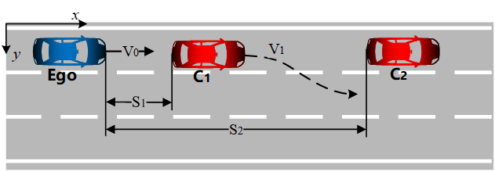
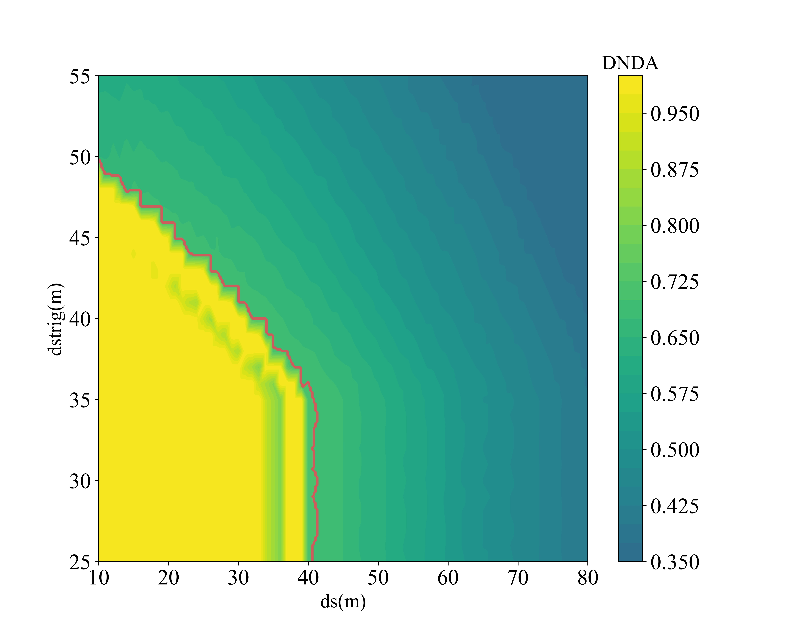

## IV2023-papaer-'Accelerated Testing of Autonomous Vehicles Based on Dual Surrogates' ###

## experiment in Cut-in scenario
The scenario configuration is shown as below. Except for the distance (S1 = [30,100]m) between ego vehicle(Ego) and the cut-in vehicle(C1) and the longitudinal speed (V1 = [10,30]m/s) of C1, other scenario parameters are fixed

A fine-grained grid (100×100) search is performed to get the ground truth of the objective function in the parameter space for benchmarking. As shown below, the critical subspaces are identified with red outlines.

### A.Validation of the Accelerated Testing Method

The performance of each method in this logical scenario is shown as below. Compared with other methods, DUSGAT has the best performance. 

### B.Validation of the Behavior Surrogate

The predicted distribution of the critical subspaces in this logical scenario output by the behavior surrogate is shown as below, in which the critical subspaces are marked in yellow

1). prediction result of critical scenarios:
precision:0.9927
recall:0.9706

2). prediction result of non-critical scenarios:
precision:0.9993
recall:0.9973

## experiment in Cut-out scenario
The variable parameters are the distance(ds=[10,80]m) between the ego car and the vehicle(C1) in front and the triggering distance(dstrig=[25,55]m) of C1 in front to change lanes. This distance is the distance between C1 and C2

A fine-grained grid (100×100) search is performed to get the ground truth of the objective function in the parameter space for benchmarking. As shown below, the critical subspaces are identified with red outlines.

### A.Validation of the Accelerated Testing Method

The performance of each method in this logical scenario is shown as below. Compared with other methods, DUSGAT has the best performance. 

### B.Validation of the Behavior Surrogate

The predicted distribution of the critical subspaces in this logical scenario output by the behavior surrogate is shown as below, in which the critical subspaces are marked in yellow

1). prediction result of critical scenarios:
precision:0.9927
recall:0.9706

2). prediction result of non-critical scenarios:
precision:0.9993
recall:0.9973

